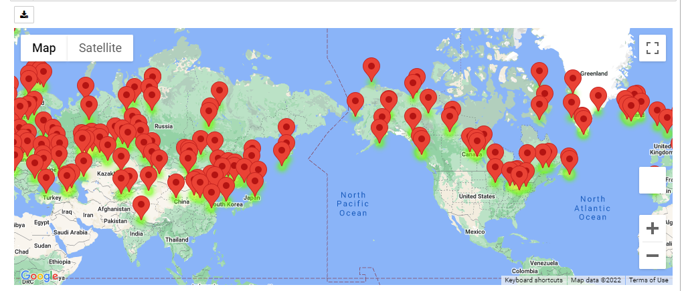
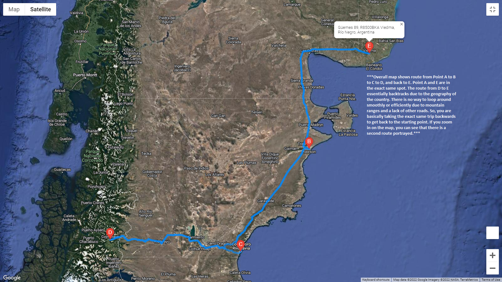
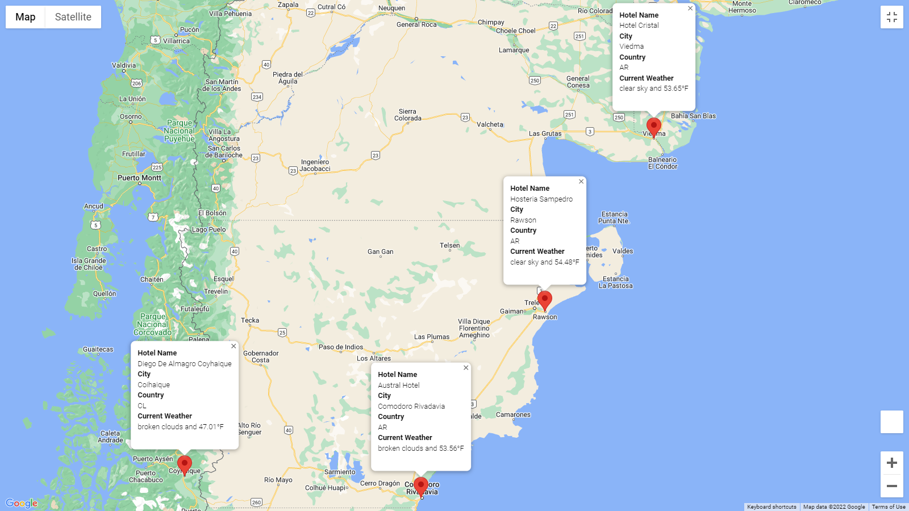

# World Weather Analysis

## Overview of Project
PlanMyTrip has recommended a few changes to take their app to the next level. Specifically, they recommend adding the weather description to the weather data.

For this challenge, weather description data was used to enhance the PlanMyTrip app. This enhancement will have the beta testers use input statements to filter the data for their weather preferences, which will be used to identify potential travel destinations and nearby hotels. The beta tester will choose four cities from the list of potential travel destinations to create a travel itinerary. Finally, using the Google Maps Directions API, you will create a travel route between the four cities and a marker layer map.

This new enhancement consists of three technical analyses:
* Deliverable 1: Retrieve Weather Data
* Deliverable 2: Create a Customer Travel Destinations Map
* Deliverable 3: Create a Travel Itinerary Map

Using several API sources, a map was created from a list of random latitudes and longitudes around the world- The user is asked to input their temperature preferences, and the map is geneerated showing places around the world that the user can visit. There are markers on the map to show details about the place such as city, country, nearby hotel information, and the current weather. A sample map is below:

From the map above, 4 cities are picked to visit while on vacation. The map below shows the travel itinerary. In this particular case, the traveler is in Argentina in the city of Viedma. From there, they will travel to Rawson and then to Comodoro Rivadavia and then to Coihaique. The map below outlines the travel path to each city and the back to Viedma. It was interesting looking at this itinerary because there is only 1 path to all of these cities and the exact same path is taken back...the terrain is very mountainous and there is very little infrastructure. I can only imagine traffic in this area.... 

The cities from the itinerary map are shown below with more detail so the travelers know what hotels are nearby in those cities and what the current weather is. 

